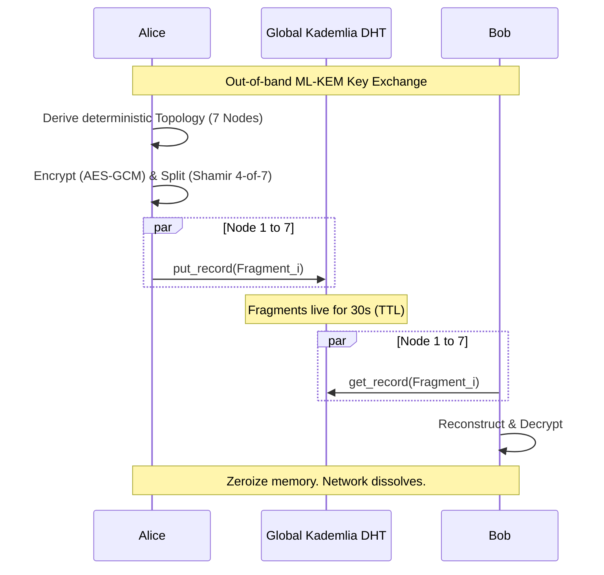

# ⬡ POLYGONE

> *"Information does not exist. It drifts."* / *"L'information n'existe pas. Elle traverse."*

**POLYGONE** is a post-quantum ephemeral privacy network designed to solve the **Metadata Problem**. Built in pure Rust.

🇫🇷 **POLYGONE** est un réseau de confidentialité post-quantique éphémère conçu pour résoudre le **Problème des Métadonnées**. Construit en Rust pur.

---

**English** | [Français](#français)

---

## English

### The Problem: The Metadata Leak

[](LICENSE)
[]()
[]()
[]()

---

## The Problem: The Metadata Leak

Traditional encryption protects **content**, but it cannot hide that a **communication occurred**. Source IPs, target IPs, timing, and packet sizes remain visible to observers. For a global adversary, metadata is often more valuable than content.

**POLYGONE changes the paradigm.** 

Instead of an encrypted tunnel between A and B, POLYGONE turns a message into a distributed, transient mathematical state—a wave that crosses a global DHT and then vaporizes. To an outside observer, there is no message; there is only ambient asynchronous noise across 7 random nodes.

---

## How it Works: The 4-Step Vaporization



### 1. Post-Quantum Handshake
Alice and Bob exchange a single **ML-KEM-1024** (FIPS 203) public key. This key does not encrypt the payload; it defines the network architecture for the transit.

### 2. Deterministic Topology
Alice and Bob use **BLAKE3** to derive a deterministic graph of 7 virtual nodes from their shared secret. Nobody else can predict which Kademlia keys will be targeted.

### 3. Shamir Dispersion
The payload is encrypted with **AES-256-GCM**, then fragmented via **Shamir's Secret Sharing (t=4, n=7)**. Fragments are dropped into the global DHT via `libp2p`. No single relay ever holds more than one fragment—mathematically impossible to reconstruct without a quorum.

### 4. Atmospheric Vaporization
Data has an aggressive **30s TTL**. It evaporates from the RAM of the relays automatically. Locally, `ZeroizeOnDrop` ensures that no trace remains in Alice or Bob's memory.

---

## Benchmarks: Cryptography at the Speed of Light

Measured on a standard modern CPU. Total cryptographic latency for a message injection is **< 0.2ms**.

| Primitive | Operation | Latency |
|---|-|---|
| **ML-KEM-1024** | Encapsulation | ~34.1 µs |
| **ML-KEM-1024** | Decapsulation | ~35.3 µs |
| **BLAKE3** | Topology Derivation | ~0.23 µs |
| **AES-256-GCM** | Encryption (1KB) | ~3.80 µs |
| **Shamir (4/7)** | Split (32B) | ~4.21 µs |
| **Full Lifecycle** | **Alice Send (E2E Crypto)** | **~207.6 µs** |

---

## Quickstart: Join the Testnet

Polygone is fully operational. You can simulate the entire global network on your machine in 30 seconds.

```bash
# 1. Install Rust Nightly
rustup toolchain install nightly && rustup default nightly

# 2. Clone and Launch the Interactive Script
git clone https://github.com/lvs0/Polygone && cd Polygone
./polygone.sh
```

Choose **Option 3 (Self-Test)** to see Alice and Bob perform a full P2P exchange through 7 local Kademlia nodes.

---

## Security Model & Philosophy

Polygone is built on the principle of **Inobservable Communication**. 

- **Post-Quantum Resistance**: All key exchanges use **ML-KEM-1024**. Signatures use **ML-DSA-87**. We assume the existence of a cryptographically relevant quantum computer (CRQC).
- **Forward Secrecy**: Every session derives a unique set of keys and a unique network topology. Even a total compromise of a peer's long-term identity does not reveal past communications.
- **Information-Theoretic Privacy**: Using Shamir Secret Sharing, we ensure that an adversary observing the DHT or controlling up to `threshold - 1` nodes gains **zero bits of information** about the payload or the target.
- **Memory Safety**: 
    - `#![forbid(unsafe_code)]` at crate root.
    - `ZeroizeOnDrop` integration for all sensitive key material.
    - Unix-level hardening (`0600` permissions for identity files).

## Known Limitations (v0.2-alpha)

Polygone is currently in an early alpha stage. The following limitations apply:

- **Local Discovery**: The current version is optimized for local or reliable VPS-to-VPS communication. NAT traversal and complex peer discovery in mobile/home networks are in active development.
- **DHT Spam**: The network does not yet implement staking or proof-of-work for `put_record` operations, making it susceptible to flood attacks in a public production environment.
- **Static Quorum**: Threshold (t=4, n=7) is currently hardcoded for stability. Dynamic adjustment of resilience vs. latency is planned for v0.3.
- **Formal Verification**: While the primitives used are standard, the full protocol state machine has not yet undergone formal verification.

---

## Contributing
Issues and PRs are welcome. We value honest technical critiques (cryptanalysis, network attacks) over polite praise.

***"Privacy is not a setting. It is an architectural property."*** ⬡

---

## 🇫🇷 Français

### Le Problème : La Fuite de Métadonnées

Le chiffrement traditionnel protège le **contenu**, mais il ne peut pas cacher qu'une **communication a eu lieu**. Les IP source, IP cible, timing et tailles de paquets restent visibles pour les observateurs.

**POLYGONE change le paradigme.**

Au lieu d'un tunnel chiffré entre A et B, POLYGONE transforme un message en état mathématique distribué transient — une vague qui traverse un DHT global puis s'évapore.

### Installation Rapide

```bash
# 1. Installer Rust Nightly
rustup toolchain install nightly && rustup default nightly

# 2. Cloner et lancer
git clone https://github.com/lvs0/Polygone && cd Polygone
./polygone.sh
```

### Modèle de Sécurité

- **Résistance Post-Quantique** : ML-KEM-1024 + ML-DSA-87
- **Sécurité Information-Théorique** : Shamir Secret Sharing (k-1 fragments = 0 info)
- **Sécurité Mémoire** : `#![forbid(unsafe_code)]` + ZeroizeOnDrop

### Limites Connues (v0.2-alpha)

- Découverte locale uniquement (v0.3 NAT traversal)
- Pas de protection anti-spam DHT
- Quorum statique (4-of-7)

---

## ⬡ Liens

- [GitHub](https://github.com/lvs0/Polygone)
- [CLI Installer](https://github.com/lvs0/Polygone-CLI)
- [Drive](https://github.com/lvs0/Polygone-Drive)
- [Hide](https://github.com/lvs0/Polygone-Hide)
- [Petals](https://github.com/lvs0/Polygone-Petals)

*"Privacy is not a setting. It is an architectural property."* ⬡
by Lévy, 14 ans, France
