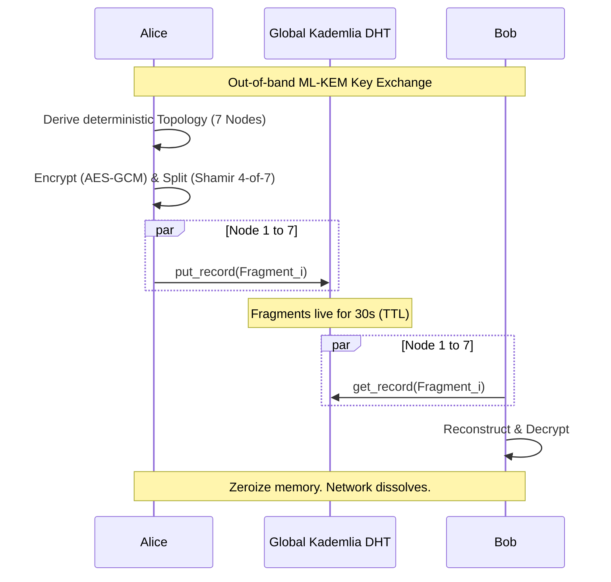

# ⬡ POLYGONE

> *"Information does not exist. It drifts."*

**POLYGONE** is a post-quantum ephemeral privacy network designed to solve the **Metadata Problem**. Built in pure Rust.

[](LICENSE)
[]()
[]()
[]()

---

## The Problem: The Metadata Leak

Traditional encryption protects **content**, but it cannot hide that a **communication occurred**. Source IPs, target IPs, timing, and packet sizes remain visible to observers. For a global adversary, metadata is often more valuable than content.

**POLYGONE changes the paradigm.** 

Instead of an encrypted tunnel between A and B, POLYGONE turns a message into a distributed, transient mathematical state—a wave that crosses a global DHT and then vaporizes. To an outside observer, there is no message; there is only ambient asynchronous noise across 7 random nodes.

---

## How it Works: The 4-Step Vaporization



### 1. Post-Quantum Handshake
Alice and Bob exchange a single **ML-KEM-1024** (FIPS 203) public key. This key does not encrypt the payload; it defines the network architecture for the transit.

### 2. Deterministic Topology
Alice and Bob use **BLAKE3** to derive a deterministic graph of 7 virtual nodes from their shared secret. Nobody else can predict which Kademlia keys will be targeted.

### 3. Shamir Dispersion
The payload is encrypted with **AES-256-GCM**, then fragmented via **Shamir's Secret Sharing (t=4, n=7)**. Fragments are dropped into the global DHT via `libp2p`. No single relay ever holds more than one fragment—mathematically impossible to reconstruct without a quorum.

### 4. Atmospheric Vaporization
Data has an aggressive **30s TTL**. It evaporates from the RAM of the relays automatically. Locally, `ZeroizeOnDrop` ensures that no trace remains in Alice or Bob's memory.

---

## Benchmarks: Cryptography at the Speed of Light

Measured on a standard modern CPU. Total cryptographic latency for a message injection is **< 0.2ms**.

| Primitive | Operation | Latency |
|---|-|---|
| **ML-KEM-1024** | Encapsulation | ~29.1 µs |
| **ML-KEM-1024** | Decapsulation | ~32.8 µs |
| **BLAKE3** | Topology Derivation | ~0.2 µs |
| **AES-256-GCM** | Encryption (1KB) | ~2.6 µs |
| **Shamir (4/7)** | Split (32B) | ~3.1 µs |
| **Full Lifecycle** | **Alice Send (E2E Crypto)** | **~178 µs** |

---

## Quickstart: Join the Testnet

Polygone is fully operational. You can simulate the entire global network on your machine in 30 seconds.

```bash
# 1. Install Rust Nightly
rustup toolchain install nightly && rustup default nightly

# 2. Clone and Launch the Interactive Script
git clone https://github.com/lvs0/Polygone && cd Polygone
./polygone.sh
```

Choose **Option 3 (Self-Test)** to see Alice and Bob perform a full P2P exchange through 7 local Kademlia nodes.

---

## Technical Audit & Safety
- **No Unsafe Code**: `#![forbid(unsafe_code)]` at crate root.
- **Memory Hardening**: Keys are zeroed immediately after use. Private keys are stored with `0600` permissions.
- **Information Theoretic Security**: Fragmentation ensures that even if 3 out of 7 nodes are compromised, your data remains secret.

---

## Contributing
Issues and PRs are welcome. We value honest technical critiques (cryptanalysis, network attacks) over polite praise.

***"Privacy is not a setting. It is an architectural property."*** ⬡
by Hope
